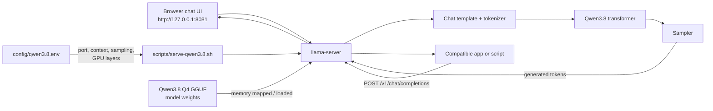

# How local Qwen3.8 works

This is a practical map of what happens after the model has been downloaded. The model runs on the local machine: requests made to `127.0.0.1` do not leave the machine.



## Starting it

The usual macOS/Linux path is:

```sh
./scripts/download-qwen3.8.sh  # only needed initially; safe to re-run
./scripts/serve-qwen3.8.sh
```

`serve-qwen3.8.sh` reads `config/qwen3.8.env` and starts `llama-server`. The server binds to `127.0.0.1:8081`, which means only software on the same machine can reach it. Opening `http://127.0.0.1:8081` shows the included web chat UI.

The same server also exposes an OpenAI-compatible API:

- `GET /v1/models` lists the loaded model.
- `POST /v1/chat/completions` is the normal chat endpoint.
- `POST /v1/completions` is the older text-completion endpoint.
- `POST /v1/responses` supports the newer Responses-style API.

On Windows, use `scripts/download-qwen3.8.ps1` and `scripts/serve-qwen3.8.ps1`. See [docs/platform-setup.md](docs/platform-setup.md) for the platform build commands.

## The GGUF and its weights

A model is a very large set of learned numbers called **weights**. During text generation, each transformer layer applies mathematical operations using those weights to estimate the next token.

The original Qwen3.8-27B model has about 27 billion parameters. The selected `UD-Q4_K_XL` GGUF stores them in an approximately 4-bit quantized form, reducing the model file to about 16.7 GiB. Quantization trades a small amount of numerical precision for a model that can fit in much less memory and run locally.

The GGUF file also carries metadata needed by the runtime, such as tokenizer data, model architecture, and the chat template. `llama.cpp` reads the file, maps or loads the weights into memory, and sends layers to the selected compute backend:

- Apple Silicon normally uses Metal.
- Linux or Windows can use CUDA with a supported NVIDIA GPU.
- All platforms can fall back to CPU inference, which works but is slower.

Weights are not the only memory cost. Conversation context is kept in a **KV cache**. Longer conversations need more KV-cache memory, which is why the project starts with an 8,192-token context instead of the model’s 262K maximum.

## Parameters in the configuration

| Parameter | What it controls | Project default |
| --- | --- | ---: |
| `CONTEXT_SIZE` / `ContextSize` | Maximum tokens retained for a request/conversation; higher uses more memory. | 8192 |
| `GPU_LAYERS` / `GpuLayers` | Number of model layers offloaded to a GPU. `99` means try to offload all layers. | 99 |
| `PARALLEL_SLOTS` / `ParallelSlots` | Simultaneous server request slots; more slots trade memory and speed for concurrency. | 1 |
| `TEMPERATURE` | Randomness. Lower is more predictable; higher is more varied. | 1.0 |
| `TOP_P` | Limits sampling to tokens in the most likely cumulative probability mass. | 0.95 |
| `TOP_K` | Limits sampling to the top *K* candidate tokens. | 20 |
| `MIN_P` | Removes candidates whose probability is too small relative to the best candidate. | 0.0 |
| `PRESENCE_PENALTY` | Discourages reusing tokens/topics that already appeared. | 0.0 |

The checked-in values use the Qwen thinking-mode preset. For ordinary non-thinking chat, a good starting preset is `TEMPERATURE=0.7`, `TOP_P=0.80`, `TOP_K=20`, and `PRESENCE_PENALTY=1.5`.

## What happens for one chat message

1. The UI or API client sends your message to `llama-server`.
2. The server applies the Qwen chat template and turns the text into tokens.
3. The transformer runs those tokens through its quantized weights, while updating the KV cache.
4. The sampler applies temperature, top-p, top-k, min-p, and penalties to choose each next token.
5. The server streams or returns generated tokens to the UI or API client.

For a small API check after startup:

```sh
curl http://127.0.0.1:8081/v1/models
```

Keep the server bound to `127.0.0.1` unless you deliberately want to make it reachable by other devices; opening it to a network without authentication is unsafe.
